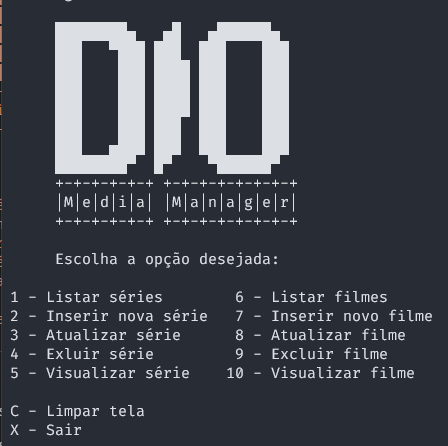

# Bootcamp DIO/Take

## 1° Desafio - Cadastro de Séries

------

Este repositório foi criado para armazenar e compartilhar o código do primeiro desafio do Bootcamp.



💻 Para executar:

```bash
git clone https://github.com/mabner/DIO_Bootcamp_Take_Series.git
cd DIO_Bootcamp_Take_Series
dotnet run
```

